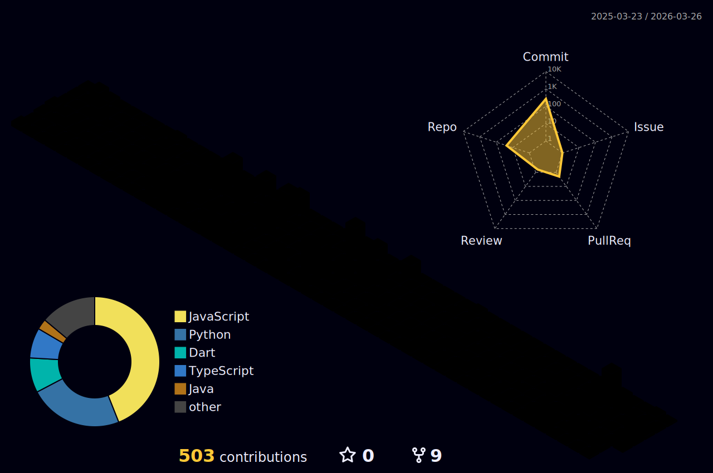

# 💫 About Me:
🔭 I’m currently working on Development 👯 I’m looking to collaborate on AI/ML Projects 🌱 I’m currently learning AI/ML 💬 Ask me about DSA

## 🌐 Socials:
  

# 💻 Tech Stack:
                   

# 📊 GitHub Stats:
 
 

### ✍️ Random Dev Quote

### 🔝 Top Contributed Repo

<picture>
  <source media="(prefers-color-scheme: dark)" srcset="https://raw.githubusercontent.com/harivansh-b/harivansh-b/output/github-snake-dark.svg" />
  <source media="(prefers-color-scheme: light)" srcset="https://raw.githubusercontent.com/harivansh-b/harivansh-b/output/github-snake.svg" />
  
</picture>

<h3 align="left">Languages and Tools:</h3>

                    

## <picture>  </picture> My Competitive Programming Profiles

  
	
	
	

